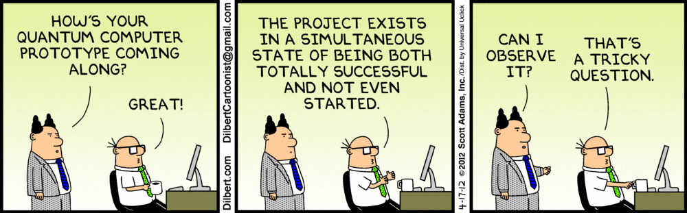

# Hello Quantum World

Resources and extra materials for posters and meetings/conferences.

## List of resources

|  Conference/Meeting    |  URL extra materials  |  Language  |
| :--------------------: | :-------------------: | :--------: |
| [ICE6-2021](https://www.ice-6.hbar.es/) | [https://sergiomtzlosa.github.io/ice62021.html](https://sergiomtzlosa.github.io/ice62021.html) | English |
| [EQTC-2021](https://www.eqtc.org) | [https://sergiomtzlosa.github.io/eqtc2021.html](https://sergiomtzlosa.github.io/eqtc2021.html) | English |
| [JJIQFA-2021](https://eventos.unizar.es/70156/detail/9o-jornada-de-jovenes-investigadores-de-quimica-y-fisica-de-aragon.html) | [https://sergiomtzlosa.github.io/jjiqfa2021.html](https://sergiomtzlosa.github.io/jjiqfa2021.html) | Spanish |
| [JJIQFA-2021](https://eventos.unizar.es/70156/detail/9o-jornada-de-jovenes-investigadores-de-quimica-y-fisica-de-aragon.html) | [https://sergiomtzlosa.github.io/jjiqfa2021-en.html](https://sergiomtzlosa.github.io/jjiqfa2021-en.html) | English |
